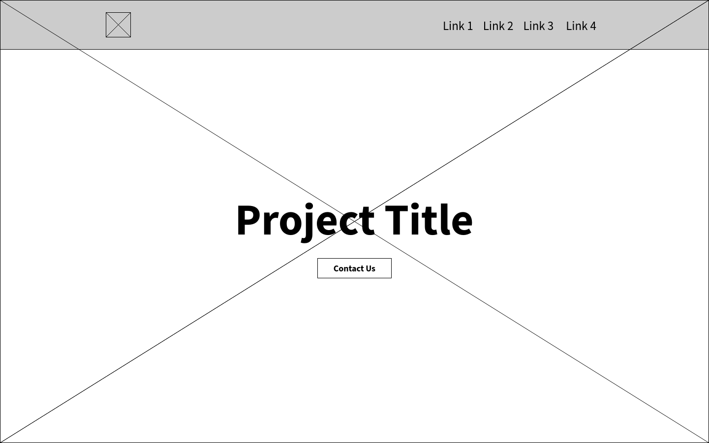
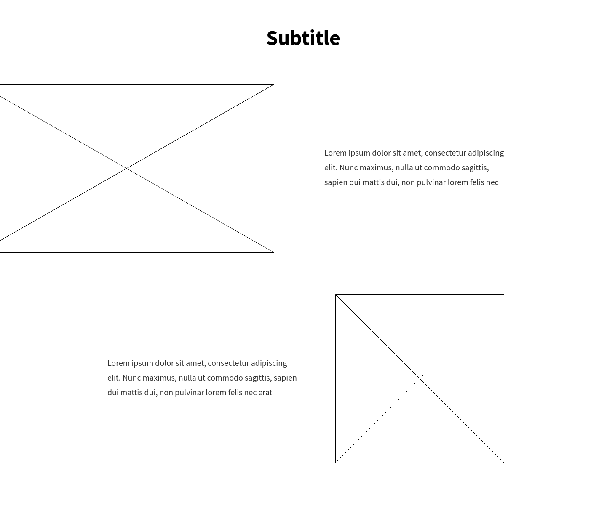
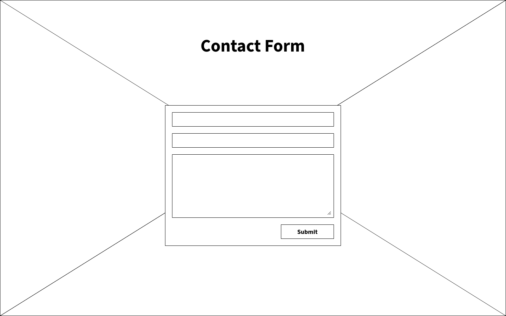

# Description

Create a single-page application with a landing page and a contact form for collecting visitors' feedback. The resulting project should contain both server and client sides.

## Server-side

The project should have a simple NodeJS server that has two endpoints:

1. `GET /` – serves landing page for the user,
2. `POST /feedback` – collect users feedback via the contact form, prints it to console.

Extra:

- Usage of React/preact,
- Setup CSRF protection,
- Setup DB to save users' feedback,
- Setup sending users' feedback to the email address provided via config,
- Tests.

### Server-side checklist

- [ ] Clean code and proper files structure
- [ ] README with instructions on how to run the server
- [ ] Server start on the port provided via config file or environment variables
- [ ] GET request to `/` returns HTML of the landing page
- [ ] POST request to `/feedback` prints sent data to the server console and send `200 OK` as a response

## Client-side

The page should contain a header with a logo and some menu items. For mobile devices, the menu should be in the hamburger menu format. During scroll, the header should stick to the window top. The main part of the page consists of 3 sections:

1. Title section — browser window high section with:

- large project title in the centre,
- `Contact us` button right under the title,
- full-size background image with small parallax effect dependant on scroll.

2. Main section — block with info about the project with:

- two smaller blocks that have image and text,
- 1st image is partially visible,
- On mobile blocks stacks in corresponding order: image 1, text 1, image 2, text 2.

3. Contact section – block with full-size background image and contact form

- when the form is submitted a small popup appears informing if data was sent successfully,
- clicking outside the popup closes it,
- if sending data failed the respective message must be displayed.

The last element on the page is a footer with some contact information to the left, other links to the right, and a copyright block at the end.

### Complete layout

### Client-side checklist

- [ ] File structure:
  - HTML file with the layout
  - Source script files (TypeScript >=ES6)
  - Source styles files (SCSS)
  - Compiled website (JS, CSS)
- [ ] No external libraries used (jQuery, Bootstrap, etc.)
- [ ] BEM methodology is used for the naming of class elements (`block__element--modifier`)
- [ ] Code is formatted according to the [Google JavaScript Style Guide](https://google.github.io/styleguide/jsguide.html)
- [ ] Page looks good on mobile devices
- [ ] Page looks similar in main browsers (Chrome, Firefox[, Safari])
- [ ] Contents on the page are limited by maximum width, but backgrounds of sections are full width
- [ ] Header is always on the top of the page while scrolling
- [ ] Header has hamburger menu on mobile devices
- [ ] Title section is browser window high with responsive full-size background image
- [ ] Contact us button in title section scrolls to contact section smoothly
- [ ] Main section has two rows with one image and text each on desktop
- [ ] Main section has all blocks one under another on mobile
- [ ] Contact section has a form that sends data to the server.