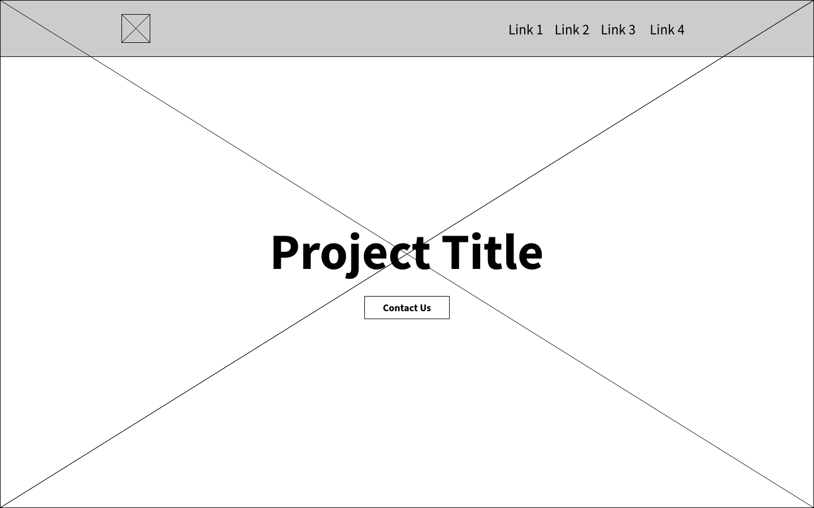
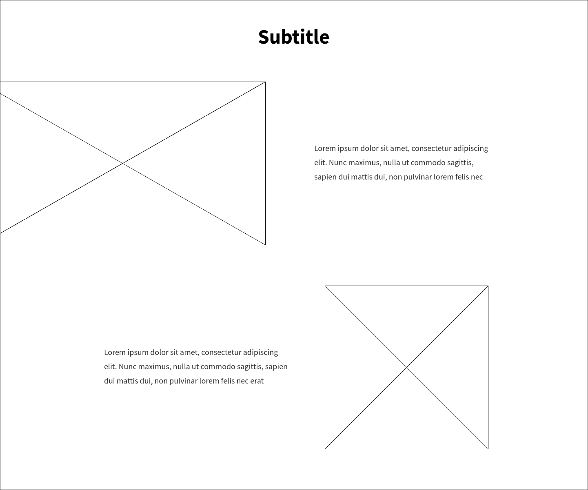
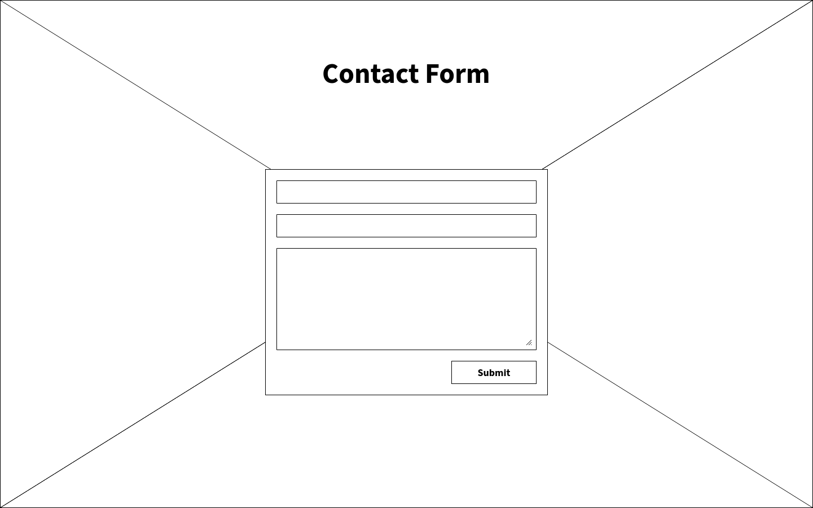
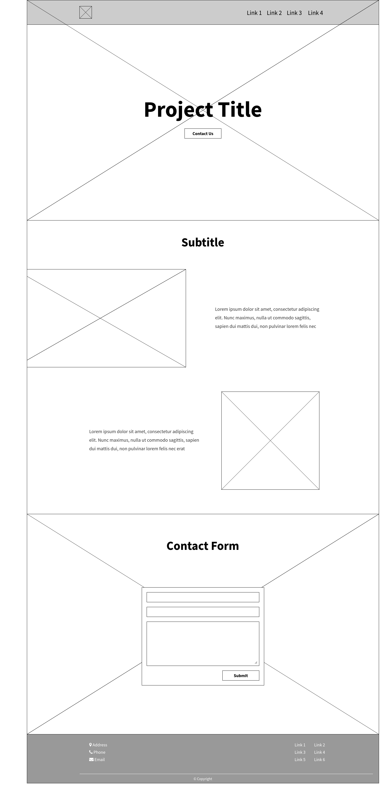

# Description

Create a responsive landing page. The page should contain a header with a logo and some menu items. For mobile devices, the menu should be moved to a hamburger menu. The header should stick to the window top while the page is being scrolled. The main part of the page consists of 3 sections:

1. Title section — browser window high section with:
  * large project title in the centre,
  * `Contact us` button right under title,
  * full size background image.

  

2. Main section — block with info about project with:
  * two smaller blocks that has image and text
  * 1st image is partially visible
  * On mobile blocks stacks in corresponding order: image 1, text 1, image 2, text 2

  

3. Contact section – block with full size background image and contact form

  

Last element on the page is a footer with some contact information to the left, other links to the right and copyright block in the end

# Complete layout

# Checklist before sending

- [ ] File structure:
  * HTML file with layout
  * Script file (JavaScript/TypeScript)
  * Styles file (CSS/SCSS)
- [ ] No external libraries used (jQuery, Bootstrap, etc.)
- [ ] BEM methodology is used for the naming of class elements (`block__element--modifier`)
- [ ] Code is formatted according to the [Google JavaScript Style Guide](https://google.github.io/styleguide/jsguide.html)
- [ ] Page looks good on mobile devices
- [ ] Page looks similar in main browsers (Chrome, Firefox[, Safari])
- [ ] Content on page is limited by maximum width but backgrounds of sections are full width
- [ ] Header is always on the top of the page while scrolling
- [ ] Header has hamburger menu on mobile devices
- [ ] Title section is browser window high with responsive full size background image
- [ ] Contact us button in title section scrolls to contact section
- [ ] Main section has two rows with one image and text each on desktop
- [ ] Main section has all block one under another on mobile
- [ ] Contact section has form that on submit prints all entered data into browser console
